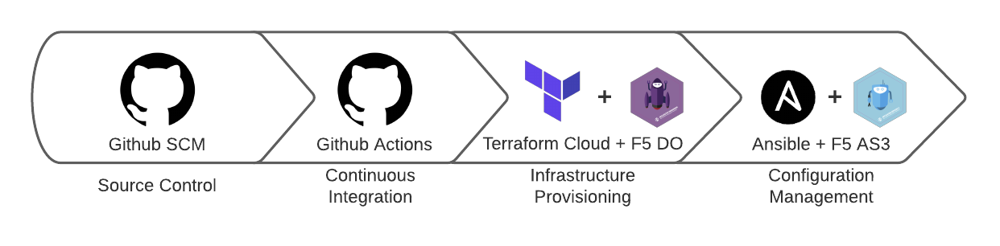
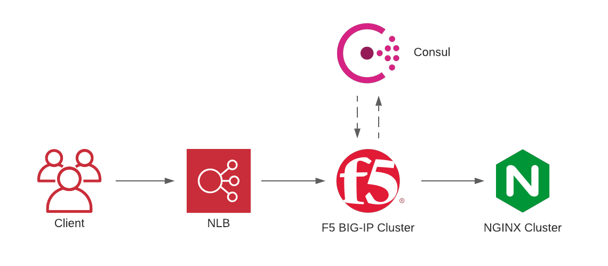

# F5, Github Actions, Terraform, and Ansible Demo

A series of Terraform templates and Ansible playbook that demonstrates how Github Actions, Terraform Cloud, and Ansible can be leveraged to achieve infrastructure as code for F5 BIG-IP devices

## Architecture Diagram

<!-- BEGINNING OF PRE-COMMIT-TERRAFORM DOCS HOOK -->
## Requirements

| Name | Version |
|------|---------|
| terraform | >= 0.13.5 |
| aws | >= 2.3 |
| null | >= 3.0 |
| random | >= 2.3 |
| template | >= 2.1 |

## Providers

| Name | Version |
|------|---------|
| aws | >= 2.3 |
| null | >= 3.0 |

## Inputs

| Name | Description | Type | Default |
|------|-------------|------|---------|
| key\_pair | n/a | `any` | n/a |
| bigip\_count | Number of F5 BIG-IPs in cluster to provision | `number` | `2` |
| nginx\_count | Number of Nginx nodes in cluster to provision | `number` | `3` |
| tower\_server | Hostname or IP address of Ansible Tower server Ansible Playbook will be executed on. | `any` | n/a |
| tower\_username | Username to authenticate into Ansible Tower server. | `any` | n/a |
| tower\_password | Password to authenticate into Ansible Tower server. | `any` | n/a |
| tower\_job\_id | Ansible Tower job ID for the Ansible Tower job to be executed as part of the Terraform job. | `any` | n/a |

## Outputs

| Name | Description |
|------|-------------|
| bigip\_management\_ips | List of management public IPs to access provisioned F5 appliances. |
| nlb\_dns\_name | DNS name for tier one load balancer that targets the F5 demo VIP. |

<!-- END OF PRE-COMMIT-TERRAFORM DOCS HOOK -->